# YT-LLM Transcription Service

A high-performance FastAPI service for YouTube audio transcription with advanced speaker diarization and LLM-optimized output formatting. Built with WhisperX for state-of-the-art accuracy and CUDA support for scalable processing.

> **⚠️ IMPORTANT: GPU/CUDA REQUIRED**
> This application is designed and tested for NVIDIA GPU with CUDA support. While CPU mode is available as a fallback option, it is **10-20x slower** and **not recommended for production use**. For optimal performance, an NVIDIA GPU with CUDA support is strongly recommended.

## ✨ Features

### Core Capabilities
- **YouTube Audio Processing**: Direct download and transcription from YouTube URLs
- **File Upload Support**: Transcribe uploaded video/audio files
- **Speaker Diarization**: Advanced speaker separation using pyannote.audio
- **Multiple Output Formats**: Simple text, speaker-separated, structured JSON, and Markdown
- **LLM-Optimized Outputs**: Clean, formatted transcriptions ready for AI processing
- **GPU Acceleration**: CUDA support for high-speed processing
- **Persistent Storage**: Automatic saving and organization of transcriptions

### Advanced Features
- **Filler Word Removal**: Intelligent removal of "um", "uh", and other speech disfluencies
- **Speaker Merging**: Automatic merging of consecutive segments from the same speaker
- **Batch Processing**: Configurable batch sizes for optimal performance
- **RESTful API**: Complete FastAPI implementation with automatic OpenAPI documentation
- **Docker Support**: Containerized deployment with GPU passthrough
- **Health Monitoring**: Built-in health checks and device information endpoints

## 🛠 Tech Stack

- **Framework**: FastAPI with async/await support
- **ML Models**: WhisperX (large-v3-turbo), pyannote.audio for diarization
- **Audio Processing**: yt-dlp for YouTube downloads, ffmpeg for format conversion
- **GPU Support**: CUDA/cuDNN with PyTorch backend
- **Containerization**: Docker with NVIDIA runtime support
- **Language**: Python 3.11+ with type hints throughout

## 🚀 Quick Start

### How It Works



### Prerequisites

- Docker and docker-compose
- **NVIDIA GPU with CUDA support (REQUIRED for optimal performance)**
  - RTX 3000 series or newer recommended
  - Minimum 8GB VRAM for large-v3-turbo model
  - NVIDIA Container Toolkit for Docker GPU access
- HuggingFace account (free) - get token from https://huggingface.co/settings/tokens
- CPU-only mode available but **NOT recommended** (10-20x slower)

### Installation (Docker - Recommended)

**Why Docker?** This project has complex dependencies (WhisperX, PyTorch, CUDA, ffmpeg, yt-dlp). Docker handles everything automatically.

1. **Clone the repository**
```bash
git clone https://github.com/amlucas0xff/yt-llm-service.git
cd yt-llm-service
```

2. **Configure environment**
```bash
# Copy environment template
cp .env.example .env

# Edit .env and set your HuggingFace token
nano .env  # or vim, code, etc.
# Set: HF_TOKEN=your_token_here
```

3. **Start the service**
```bash
docker-compose up --build
```

The service will be available at `http://localhost:8002`

**First run:** Docker will download ML models (~2-3GB). This may take several minutes.

### Quick Test

```bash
# Check service health
curl http://localhost:8002/health

# Transcribe a YouTube video
curl -X POST "http://localhost:8002/transcribe-youtube-llm" \
  -H "Content-Type: application/json" \
  -d '{
    "youtube_url": "https://www.youtube.com/watch?v=dQw4w9WgXcQ",
    "output_format": "simple"
  }'
```

## 📋 API Documentation

### Interactive Documentation
- **Swagger UI**: http://localhost:8002/docs
- **ReDoc**: http://localhost:8002/redoc

### Core Endpoints

#### 1. YouTube Transcription (LLM-Optimized)
```bash
POST /transcribe-youtube-llm
```

**Example Request:**
```json
{
  "youtube_url": "https://www.youtube.com/watch?v=dQw4w9WgXcQ",
  "output_format": "markdown",
  "remove_filler_words": true,
  "merge_consecutive_speakers": true,
  "min_speakers": 1,
  "max_speakers": 3
}
```

**Example Response:**
```json
{
  "success": true,
  "text": "# Transcription\n\n**Speaker 1:** Never gonna give you up, never gonna let you down...",
  "language": "en",
  "metadata": {
    "video_id": "dQw4w9WgXcQ",
    "duration": 212,
    "speakers_detected": 1,
    "word_count": 156
  }
}
```

#### 2. File Upload Transcription
```bash
POST /transcribe-file-llm
```

Upload video/audio files directly for transcription.

#### 3. Health Check
```bash
GET /health
```

Returns service status and GPU information.

### Output Formats

- **simple**: Clean text without speaker labels
- **speaker**: Text with speaker identification
- **structured**: JSON with detailed segment information
- **markdown**: Formatted Markdown with speaker headers

## 🔧 Configuration

### Environment Variables

| Variable | Default | Description |
|----------|---------|-------------|
| `DEVICE` | `cuda` | Processing device (cuda/cpu) |
| `WHISPER_MODEL` | `large-v3-turbo` | Whisper model size |
| `BATCH_SIZE` | `16` | Processing batch size |
| `HF_TOKEN` | - | HuggingFace API token |
| `LOG_LEVEL` | `INFO` | Logging verbosity |

See `.env.example` for complete configuration options.

### Performance Tuning

#### GPU Memory Optimization (Recommended)
```bash
# For 8GB GPU (RTX 3060, RTX 3070)
DEVICE=cuda
BATCH_SIZE=8
COMPUTE_TYPE=float16

# For 12-16GB GPU (RTX 3080, RTX 3090)
DEVICE=cuda
BATCH_SIZE=16
COMPUTE_TYPE=float16

# For 24GB+ GPU (RTX 4090, A5000)
DEVICE=cuda
BATCH_SIZE=32
COMPUTE_TYPE=float16
```

#### CPU Fallback (Not Recommended for Production)
```bash
# CPU-only mode (10-20x slower, use only if no GPU available)
DEVICE=cpu
COMPUTE_TYPE=float32
BATCH_SIZE=4
```

## 📁 Project Structure

```
yt-llm-service/
├── src/                    # Core application code
│   ├── run_llm_api.py           # FastAPI service
│   ├── transcription_service.py # Transcription engine
│   ├── audio_downloader.py      # YouTube/file processing
│   ├── storage_service.py       # Result persistence
│   └── config.py                # Configuration
├── data/                   # Runtime data (gitignored)
│   ├── output/                  # Saved transcriptions
│   ├── tmp/                     # Temporary files
│   └── logs/                    # Application logs
├── docs/                   # Documentation
│   └── images/                  # Diagrams and visuals
├── docker-compose.yml      # Docker orchestration
├── Dockerfile              # Container image
├── requirements.txt        # Python dependencies
├── .env.example            # Environment template
└── README.md               # This file
```

## 🐳 GPU Support (Required for Production)

**This application is designed for GPU acceleration. CPU mode is available but not recommended.**

1. **Install NVIDIA Container Toolkit** (Required for GPU access)
```bash
# Ubuntu/Debian
distribution=$(. /etc/os-release;echo $ID$VERSION_ID)
curl -s -L https://nvidia.github.io/nvidia-docker/gpgkey | sudo apt-key add -
curl -s -L https://nvidia.github.io/nvidia-docker/$distribution/nvidia-docker.list | \
  sudo tee /etc/apt/sources.list.d/nvidia-docker.list

sudo apt-get update && sudo apt-get install -y nvidia-docker2
sudo systemctl restart docker
```

2. **Verify GPU access**
```bash
docker run --rm --gpus all nvidia/cuda:12.2.0-base-ubuntu22.04 nvidia-smi
```

### CPU-Only Fallback (Not Recommended)

**⚠️ WARNING: CPU mode is 10-20x slower than GPU mode.**

If you don't have an NVIDIA GPU, you can use CPU mode as a fallback:
1. Edit `.env` and set:
   ```
   DEVICE=cpu
   COMPUTE_TYPE=float32
   BATCH_SIZE=4
   ```
2. Note: Processing will be significantly slower and not suitable for production workloads.
3. Consider using a cloud GPU instance for better performance.

## 📊 Performance Benchmarks

| Model | GPU | Batch Size | Processing Speed | Accuracy |
|-------|-----|------------|------------------|----------|
| large-v3-turbo | RTX 4090 | 32 | ~10x realtime | Excellent |
| large-v3-turbo | RTX 3080 | 16 | ~6x realtime | Excellent |
| large-v3 | RTX 4090 | 16 | ~4x realtime | Superior |
| CPU-only | Intel i9 | 4 | ~0.5x realtime | Good |

*Benchmarks based on typical YouTube content (10-minute videos)*

## 🤝 Contributing

1. Fork the repository
2. Create a feature branch: `git checkout -b feature-name`
3. Commit changes: `git commit -am 'Add feature'`
4. Push to branch: `git push origin feature-name`
5. Submit a pull request

## 📄 License

This project is licensed under the MIT License - see the [LICENSE](LICENSE) file for details.

## 🙏 Acknowledgments

- [WhisperX](https://github.com/m-bain/whisperX) for advanced transcription capabilities
- [pyannote.audio](https://github.com/pyannote/pyannote-audio) for speaker diarization
- [yt-dlp](https://github.com/yt-dlp/yt-dlp) for YouTube processing
- [FastAPI](https://fastapi.tiangolo.com/) for the web framework

---

**Built with ❤️ for the AI/ML community**