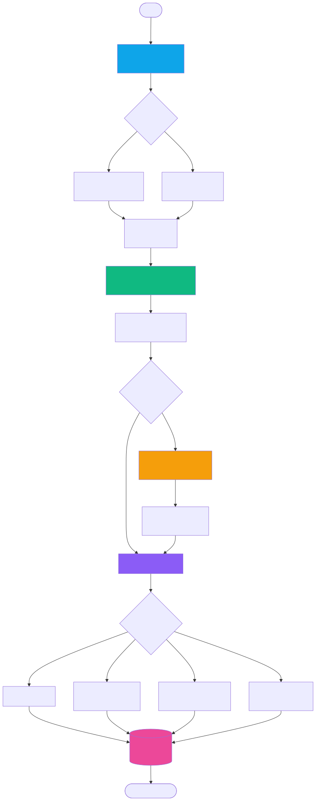

# YT-LLM Transcription Service

A high-performance FastAPI service for YouTube audio transcription with advanced speaker diarization, LLM-optimized output formatting, and automated structured notes generation via a local LLM sidecar.

> **IMPORTANT: Dual GPU recommended**
> The service is designed for two NVIDIA GPUs: WhisperX runs on GPU 0 (8GB+ VRAM) and the llama-cpp notes sidecar runs on GPU 1 (24GB+ VRAM). Single-GPU setups and CPU fallback are possible but not recommended for production use.

## Features

### Core Capabilities
- **YouTube Audio Processing**: Direct download and transcription from YouTube URLs
- **File Upload Support**: Transcribe uploaded video/audio files
- **Speaker Diarization**: Advanced speaker separation using pyannote.audio
- **Multiple Output Formats**: Simple text, speaker-separated, structured JSON, and Markdown
- **LLM-Optimized Outputs**: Clean, formatted transcriptions ready for AI processing
- **GPU Acceleration**: CUDA support for high-speed processing
- **Persistent Storage**: Automatic saving and organization of transcriptions

### Advanced Features
- **Structured Notes Generation**: Optional post-processing via local gpt-oss-20b (llama-cpp sidecar) — produces a markdown document with title, overview, and topical sections
- **Filler Word Removal**: Intelligent removal of "um", "uh", and other speech disfluencies
- **Speaker Merging**: Automatic merging of consecutive segments from the same speaker
- **Batch Processing**: Configurable batch sizes for optimal performance
- **VRAM Idle Unload**: llama-cpp automatically unloads the model after idle timeout, reclaiming GPU memory on shared hardware
- **RESTful API**: Complete FastAPI implementation with automatic OpenAPI documentation
- **Docker Support**: Containerized deployment with GPU passthrough

## Architecture

Two Docker services, GPU-isolated:

| Service | Port | GPU | Model | Role |
|---------|------|-----|-------|------|
| `yt-llm-service` | 8002 | GPU 0 (RTX 4060, 8GB) | WhisperX large-v3-turbo | Transcription + speaker diarization |
| `llama-cpp` | 8080 | GPU 1 (RTX 3090 Ti, 24GB) | gpt-oss-20b MXFP4 | Notes generation |

`yt-llm-service` depends on `llama-cpp` (Docker healthcheck enforced). Notes generation is non-fatal — if llama-cpp is unavailable, transcription still succeeds and `notes` returns `null`.

## Tech Stack

- **Framework**: FastAPI with async/await support
- **Transcription**: WhisperX (large-v3-turbo), pyannote.audio for diarization
- **Notes LLM**: llama.cpp server (gpt-oss-20b MXFP4 GGUF, OpenAI-compatible API)
- **Audio Processing**: yt-dlp for YouTube downloads, ffmpeg for format conversion
- **GPU Support**: CUDA/cuDNN with PyTorch backend
- **Containerization**: Docker Compose with NVIDIA runtime support
- **Language**: Python 3.11+ with type hints throughout

## 🚀 Quick Start

### How It Works



### Prerequisites

- Docker and docker-compose
- **NVIDIA GPU with CUDA support (REQUIRED for optimal performance)**
  - RTX 3000 series or newer recommended
  - Minimum 8GB VRAM for large-v3-turbo model
  - NVIDIA Container Toolkit for Docker GPU access
- HuggingFace account (free) - get token from https://huggingface.co/settings/tokens
- CPU-only mode available but **NOT recommended** (10-20x slower)

### Installation (Docker - Recommended)

**Why Docker?** This project has complex dependencies (WhisperX, PyTorch, CUDA, ffmpeg, yt-dlp). Docker handles everything automatically.

1. **Clone the repository**
```bash
git clone https://github.com/amlucas0xff/yt-llm-service.git
cd yt-llm-service
```

2. **Configure environment**
```bash
# Copy environment template
cp .env.example .env

# Edit .env and set your HuggingFace token
nano .env  # or vim, code, etc.
# Set: HF_TOKEN=your_token_here
```

3. **Start the service**
```bash
docker-compose up --build
```

The service will be available at `http://localhost:8002`

**First run:** Docker will download ML models (~2-3GB). This may take several minutes.

### Quick Test

```bash
# Check service health
curl http://localhost:8002/health

# Transcribe a YouTube video
curl -X POST "http://localhost:8002/transcribe-youtube-llm" \
  -H "Content-Type: application/json" \
  -d '{
    "youtube_url": "https://www.youtube.com/watch?v=dQw4w9WgXcQ",
    "output_format": "simple"
  }'

# Transcribe + generate structured notes
curl -X POST "http://localhost:8002/transcribe-youtube-llm" \
  -H "Content-Type: application/json" \
  -d '{
    "youtube_url": "https://www.youtube.com/watch?v=dQw4w9WgXcQ",
    "output_format": "simple",
    "generate_notes": true
  }'
```

## API Documentation

### Interactive Documentation
- **Swagger UI**: http://localhost:8002/docs
- **ReDoc**: http://localhost:8002/redoc

### Core Endpoints

#### 1. YouTube Transcription (LLM-Optimized)
```bash
POST /transcribe-youtube-llm
```

**Request fields:**
| Field | Type | Default | Description |
|-------|------|---------|-------------|
| `youtube_url` | string | required | YouTube URL |
| `output_format` | string | `simple` | `simple`, `speaker`, `structured`, `markdown` |
| `generate_notes` | bool | `false` | Generate structured notes via llama-cpp |
| `remove_filler_words` | bool | `false` | Strip "um", "uh", etc. |
| `merge_consecutive_speakers` | bool | `true` | Merge adjacent segments from same speaker |
| `min_speakers` / `max_speakers` | int | `null` | Speaker count hints for diarization |

**Example response with notes:**
```json
{
  "success": true,
  "text": "Never gonna give you up, never gonna let you down...",
  "language": "en",
  "notes": "# Never Gonna Give You Up\n\n## Overview\n...",
  "metadata": {
    "video_id": "dQw4w9WgXcQ",
    "duration": 212,
    "speakers_detected": 1,
    "word_count": 156
  }
}
```

Notes are also saved to `data/output/<title>/notes.md` alongside the transcription files.

#### 2. File Upload Transcription
```bash
POST /transcribe-file-llm
```

Multipart form upload. Accepts the same parameters as above (`generate_notes`, `output_format`, etc.).

```bash
curl -X POST http://localhost:8002/transcribe-file-llm \
  -F "file=@video.mp4" \
  -F "output_format=simple" \
  -F "generate_notes=true"
```

#### 3. Audio File Path Transcription
```bash
POST /transcribe-llm
```

Transcribe a file already on the server by path. Same request shape as YouTube but with `audio_file_path` instead of `youtube_url`.

#### 4. Health Check
```bash
GET /health
```

Returns service status and GPU information.

### Output Formats

- **simple**: Clean text without speaker labels
- **speaker**: Text with speaker identification
- **structured**: JSON with detailed segment information
- **markdown**: Formatted Markdown with speaker headers

## Configuration

### Environment Variables

**yt-llm-service:**

| Variable | Default | Description |
|----------|---------|-------------|
| `DEVICE` | `cuda` | Processing device (`cuda`/`cpu`) |
| `COMPUTE_TYPE` | `float16` | Compute precision |
| `WHISPER_MODEL` | `large-v3-turbo` | Whisper model size |
| `BATCH_SIZE` | `16` | Processing batch size |
| `HF_TOKEN` | - | HuggingFace API token (required for diarization) |
| `LOG_LEVEL` | `INFO` | Logging verbosity |
| `LLAMA_CPP_URL` | `http://llama-cpp:8080` | URL of the llama-cpp sidecar |
| `NOTES_MAX_TOKENS` | `80000` | Max transcript tokens before middle truncation |

**llama-cpp sidecar:**

| Variable | Default | Description |
|----------|---------|-------------|
| `LLAMA_CPP_GPU_LAYERS` | `99` | GPU layers to offload (99 = all) |
| `LLAMA_CPP_IDLE_SECONDS` | `300` | Seconds idle before VRAM unload (-1 to disable) |
| `HF_TOKEN` | - | HuggingFace token for model download on first run |

See `.env.example` for complete configuration options.

### Performance Tuning

#### GPU Memory Optimization (Recommended)
```bash
# For 8GB GPU (RTX 3060, RTX 3070)
DEVICE=cuda
BATCH_SIZE=8
COMPUTE_TYPE=float16

# For 12-16GB GPU (RTX 3080, RTX 3090)
DEVICE=cuda
BATCH_SIZE=16
COMPUTE_TYPE=float16

# For 24GB+ GPU (RTX 4090, A5000)
DEVICE=cuda
BATCH_SIZE=32
COMPUTE_TYPE=float16
```

#### CPU Fallback (Not Recommended for Production)
```bash
# CPU-only mode (10-20x slower, use only if no GPU available)
DEVICE=cpu
COMPUTE_TYPE=float32
BATCH_SIZE=4
```

## Obsidian Integration

Generated notes can be automatically mirrored to your Obsidian vault.

1. Copy the example config:
   ```bash
   mkdir -p ~/.config/yt-llm
   cp config.example.toml ~/.config/yt-llm/config.toml
   ```
2. Edit `~/.config/yt-llm/config.toml`:
   ```toml
   [obsidian]
   enabled = true
   vault_path = "~/Documents/obsidian"   # path to your vault
   inbox_dir = "Inbox"                    # subdirectory inside vault
   tags = ["video-notes"]
   ```
3. Run `transcribe` as usual — if notes are generated, they are also saved to `{vault_path}/{inbox_dir}/{Title}.md` with YAML frontmatter (date, source URL, tags).

The integration is silent: if the config file is absent or `enabled = false`, nothing changes.

## Project Structure

```
yt-llm-service/
├── src/                         # Core application code
│   ├── run_llm_api.py           # FastAPI service + all endpoints
│   ├── transcription_service.py # WhisperX transcription engine
│   ├── notes_service.py         # Notes generation via llama-cpp
│   ├── audio_downloader.py      # YouTube/file audio extraction
│   ├── storage_service.py       # Result persistence (transcription + notes)
│   └── config.py                # Configuration (env vars)
├── llama-cpp/                   # llama-cpp sidecar service
│   ├── Dockerfile               # Builds on official llama.cpp CUDA image
│   └── entrypoint.sh            # Downloads model + starts llama-server
├── models/                      # GGUF model files (gitignored)
├── data/                        # Runtime data (gitignored)
│   ├── output/                  # Saved transcriptions + notes.md
│   ├── tmp/                     # Temporary audio files
│   └── logs/                    # Application logs
├── docs/                        # Documentation
├── docker-compose.yml           # Two-service orchestration
├── Dockerfile                   # yt-llm-service container image
├── requirements.txt             # Python dependencies
├── .env.example                 # Environment template
└── README.md                    # This file
```

## GPU Setup

This service is designed for two NVIDIA GPUs. The `docker-compose.yml` pins each service to a specific GPU index:
- `yt-llm-service` uses `count: 1` (defaults to GPU 0)
- `llama-cpp` uses `device_ids: ['1']` (explicitly GPU 1)

If your GPU layout differs from the default, edit `docker-compose.yml` accordingly and verify with:
```bash
nvidia-smi --query-gpu=index,name,memory.total --format=csv,noheader
```

### Install NVIDIA Container Toolkit

Required for Docker GPU passthrough:
```bash
# Ubuntu/Debian
distribution=$(. /etc/os-release;echo $ID$VERSION_ID)
curl -s -L https://nvidia.github.io/nvidia-docker/gpgkey | sudo apt-key add -
curl -s -L https://nvidia.github.io/nvidia-docker/$distribution/nvidia-docker.list | \
  sudo tee /etc/apt/sources.list.d/nvidia-docker.list

sudo apt-get update && sudo apt-get install -y nvidia-docker2
sudo systemctl restart docker
```

Verify GPU access:
```bash
docker run --rm --gpus all nvidia/cuda:12.2.0-base-ubuntu22.04 nvidia-smi
```

### VRAM Management

The llama-cpp sidecar unloads the model from VRAM after `LLAMA_CPP_IDLE_SECONDS` (default: 300s). The next request triggers a cold reload (~15s). This is important on shared hardware. Set `LLAMA_CPP_IDLE_SECONDS=-1` to keep the model loaded permanently.

### CPU-Only Fallback (Not Recommended)

Set in `.env`:
```
DEVICE=cpu
COMPUTE_TYPE=float32
BATCH_SIZE=4
```

Processing will be 10-20x slower. Notes generation still requires the llama-cpp sidecar regardless of transcription device.

## 📊 Performance Benchmarks

| Model | GPU | Batch Size | Processing Speed | Accuracy |
|-------|-----|------------|------------------|----------|
| large-v3-turbo | RTX 4090 | 32 | ~10x realtime | Excellent |
| large-v3-turbo | RTX 3080 | 16 | ~6x realtime | Excellent |
| large-v3 | RTX 4090 | 16 | ~4x realtime | Superior |
| CPU-only | Intel i9 | 4 | ~0.5x realtime | Good |

*Benchmarks based on typical YouTube content (10-minute videos)*

## 🤝 Contributing

1. Fork the repository
2. Create a feature branch: `git checkout -b feature-name`
3. Commit changes: `git commit -am 'Add feature'`
4. Push to branch: `git push origin feature-name`
5. Submit a pull request

## 📄 License

This project is licensed under the MIT License - see the [LICENSE](LICENSE) file for details.

## 🙏 Acknowledgments

- [WhisperX](https://github.com/m-bain/whisperX) for advanced transcription capabilities
- [pyannote.audio](https://github.com/pyannote/pyannote-audio) for speaker diarization
- [yt-dlp](https://github.com/yt-dlp/yt-dlp) for YouTube processing
- [FastAPI](https://fastapi.tiangolo.com/) for the web framework

---

**Built with ❤️ for the AI/ML community**